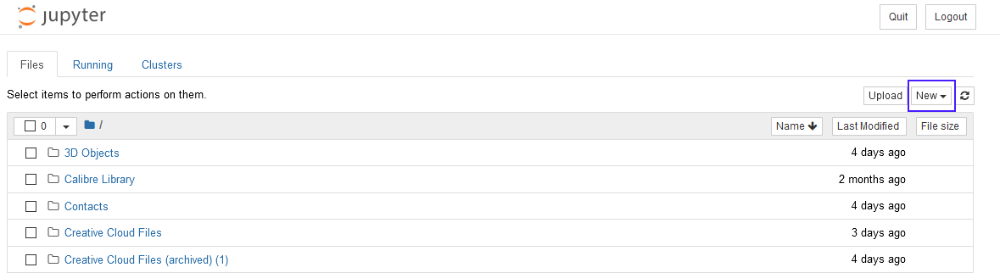
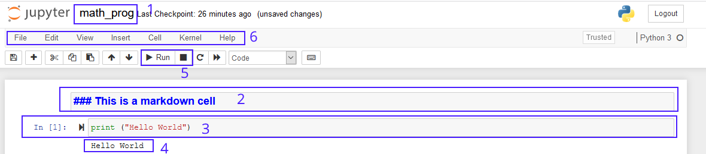

<center>

## ENSE 350 – Math Programming for Software Engineers - Laboratory

# Lab 1: Intro to Python, GCD and Pulverizer

### University of Regina
### Faculty of Engineering and Applied Science - Software Systems Engineering

### Lab Instructor: [Adam Tilson](mailto:Adam.Tilson@uregina.ca)
</center>
---

## Introduction

In this lab we will be using the programming language Python. This language was selected as it is domain specific to math programming - many fields which build on math programming, such as artificial intelligence and machine learning, have adopted Python as their standard language. This lab will briefly introduce the language, and introduce some programming concepts which are relevant to the lab portion of this course. 

In particular, we will look at using Jupyter Notebook, a web application which allows you to graphically create, edit, run and visualize your code.

## Installation routes...

The most streamlined way to install python is...

[Download the latest version of python, 3.9, here](https://www.python.org/downloads/)

Once installed, you may install Jupyter Notebook with...

```
py -m pip install notebook
```

And then start up a notebook with...

```
py -m notebook
```

Which will open Jupyter Notebook in your browser.

### Alternate Installation paths...

A great all-in-one solution to install python and Jupyter is to install Anaconda...

[Install Anaconda here](https://www.anaconda.com/products/individual)

Which includes the ability to easily create virtual environments, but is perhaps overkill for this lab.

### VS Code

If you try to open a Jupyter Notebook in VS Code, it will typically prompt you to install some packages to run Jupyter Notebooks. This works well too, but the interface is slightly different from the browser version.

### No install methods

There are also a number of ways you can use python without installing it on your local machine, such as [U of R syzygy](https://uregina.syzygy.ca/), or [Google Colaboratory](https://colab.research.google.com/). These both provide a Jupyter notebook-like environment. You can upload your notebooks, modify, run, examine, and download the completed notebook for submission.

### Jupyter Notebook

Jupyter notebook will be the preferred way to write code in this course:

Start up the notebook server with...

```
python -m notebook
```

UI Overview



In a notebook...



1. You can name your notebook here
2. To comment your notebook, you can use [markdown](https://github.com/adam-p/markdown-here/wiki/Markdown-Cheatsheet). Switch a cell to markdown with `Esc-m`.
3. Code cells contain python code. You can run a cell with with `shift+enter`
4. The output of the cell is shown directly below it
5. You can interact with the python kernel running your code on the toolbar
6. The file menu has a number of useful features, including:
   - Remove cells with edit -> delete cells (`esc-d,d`)
   - Insert cells with the Insert menu
   - Run cells using the cell menu
   - Change a cell type with cell -> Cell Type
   - Interact with the kernel from the Kernel menu. Sometimes it needs a restart!

We will use Jupyter Notebook in the pre-lab to demonstrate some of the key features of python, particularly those relevant to the lab curriculum.

Note that your notebook will save automatically from time to time, but if you have made a change you definitely want to commit, you can `File -> Save and Checkpoint`. You can revert to these earlier checkpoints if something goes horribly wrong.

## Lab Procedure

Each lab session we will have a brief prelab which will introduce some of the features of the language which may be useful to you in accomplishing this week's lab assignment, and may review some of the math concepts. These will be considered optional, but recommended. If you are confidant with the Math, Python features, you can always instead use this time to work on the lab assignment.

## Intro to python

In the example files there are three notebooks:
- eg-1 is the starter code for the pre-lab. Fill this in as we go
- eg-2 is the finished pre-lab code. You can refer to this if you fall behind.
- assn-starter is the starter code for the lab-assignment

When opening a notebook, you may need to trust it `File -> Trust Notebook` to allow you to run code and markdown.

## Math concept review and examples:
Let's work through an example of the following two algorithms:
- GCD
- Pulverizer

## Assignment

- complete the notebook `assn-starter.ipynb`
- Part 1: Complete the function `gcd` which computes the gcd of two numbers.
- Part 2: Solve the problem in the notebook
- Part 3: Complete the function `pulverizer` which implements the extended euclidean algorithm, computes the gcd of two numbers, and additionally returns the integers s and t which satisfy the condition sa + tb = gcd(a, b).
- Part 4: Solve the problem in the notebook.

You are not allowed to use any libraries outside of core Python 3, e.g. numpy.

## Submission

Please submit your `.ipynb` file to UR Courses by the due date.

---

## References

Tutorials point python, recommended links...

Tutorials Point, [Python 3 Tutorial](https://www.tutorialspoint.com/python3/index.htm)

Recommended pages:

- [Basic Syntax](https://www.tutorialspoint.com/python3/python_basic_syntax.htm)

- [Variable Types](https://www.tutorialspoint.com/python3/python_variable_types.htm)

- [Basic Operators](https://www.tutorialspoint.com/python3/python_basic_operators.htm)

- [Decision Making](https://www.tutorialspoint.com/python3/python_decision_making.htm)

- [Loops](https://www.tutorialspoint.com/python3/python_loops.htm)

- [Numbers](https://www.tutorialspoint.com/python3/python_numbers.htm)

- [Strings](https://www.tutorialspoint.com/python3/python_strings.htm)

- [Lists](https://www.tutorialspoint.com/python3/python_lists.htm)

- [Tuples](https://www.tutorialspoint.com/python3/python_tuples.htm)

- [Functions](https://www.tutorialspoint.com/python3/python_functions.htm)

GCD and Pulverizer examples:

A. Meyer, [2.1.1 GCDs & Linear Combinations: Video](https://www.youtube.com/watch?v=et3FOZdI6pk&list=PLUl4u3cNGP60UlabZBeeqOuoLuj_KNphQ&index=35), MIT OpenCourseWares, 2015

A. Meyer, [2.1.2 Euclidean Algorithm: Video](https://www.youtube.com/watch?v=dW0f62lcCLE&list=PLUl4u3cNGP60UlabZBeeqOuoLuj_KNphQ&index=36), MIT OpenCourseWares, 2015

A. Meyer, [2.1.4 Pulverizer Video](https://www.youtube.com/watch?v=yzKPotFLfsc&list=PLUl4u3cNGP60UlabZBeeqOuoLuj_KNphQ&index=37), MIT OpenCourseWares, 2015
