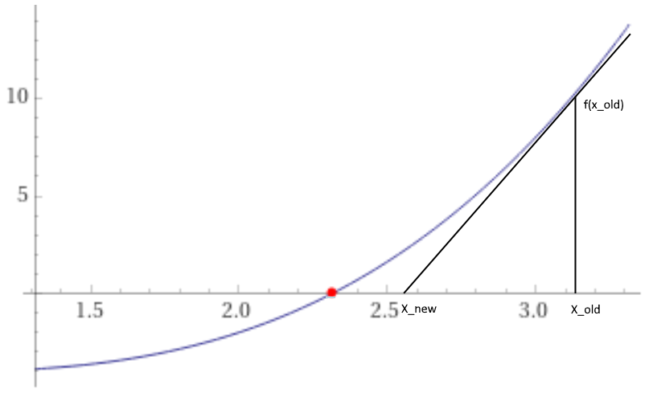
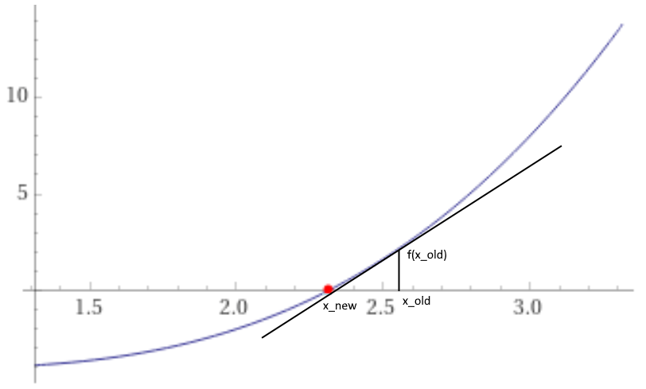
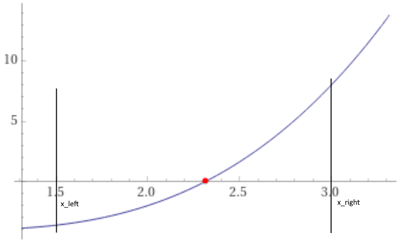
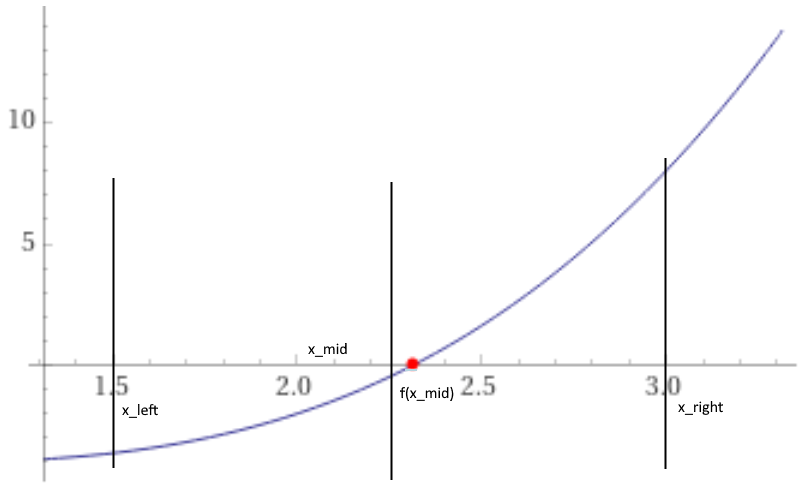
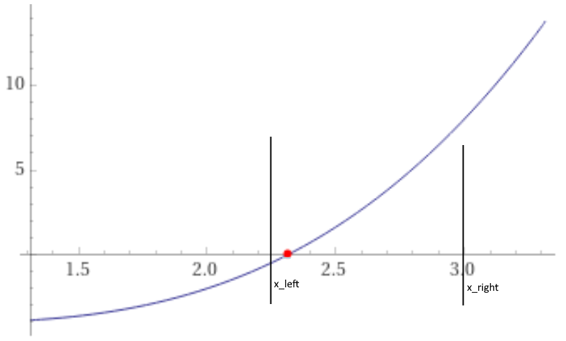
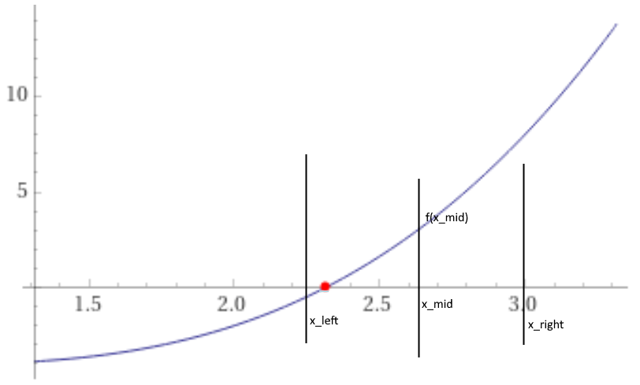
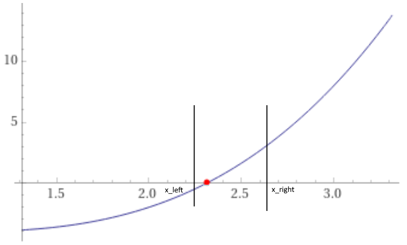
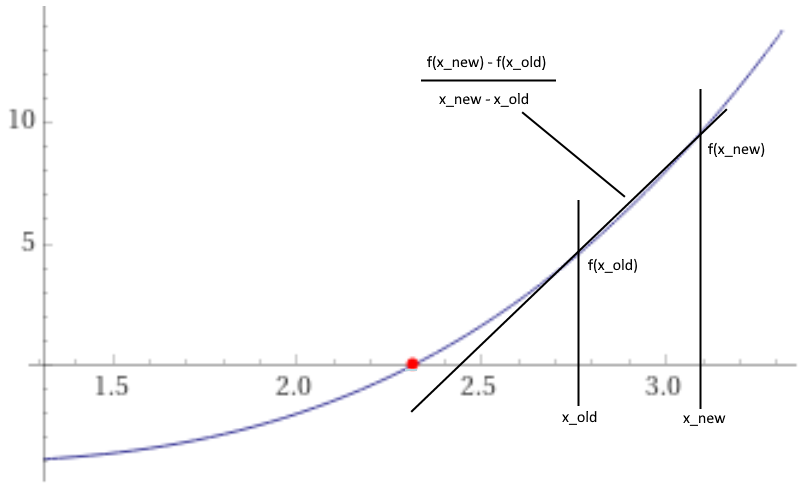
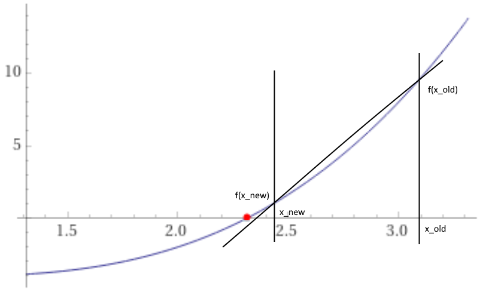

## ENSE 350 – Math Programming for Software Engineers - Laboratory

# Lab 3: Iterative Methods for Finding Roots

### University of Regina
### Faculty of Engineering and Applied Science - Software Systems Engineering

### Lab Instructor: [Adam Tilson](mailto:Adam.Tilson@uregina.ca)

---

## Introduction

In this lab we will look at iterative methods for finding roots, including Newton Raphson, Bisection and Secant. We will apply this to a polynomial as well as a real-world problem.

## Iterative Methods and Formulas

### Newton Raphson Method

Theory:

Given a continuous function and an initial point, we can compute the derivative at that point. Interpreting this derivative as a line, we can find the point where this line intersects with the x-axis using trigonometry. As the slope of the line follows the shape of the function, this point will be a better guess towards finding our root. After several iterations we will find a close approximation to our root.

Algorithm:

Using the initial guess, compute the new guess with...

$$ x_{new} = x_{old} - \frac{f(x_{old})}{f'(x_{old})}    $$

We will stop iterating either when the computed error gets low enough, or a maximum number of iterations have elapsed.

### Absolute Relative Approximate Error

We can calculate the error using the following formula:

$$ \epsilon_a = \displaystyle\left\lvert\frac{x_{old} - x_{new}}{x_{new}}\right\rvert \times 100 $$

When this value is less than a certain error threshold, we will consider this one of our two stopping conditions, along with maximum number of iterations being exceeded.

### Bisection Method

Theory:

- Given a continuous function and two points on that function, one with a negative output and one with a positive output, somewhere in between must be a root, i.e. a point where the function crosses 0. We can essentially find it through binary search, by continually dividing our search space in half and updating our bounds depending on the output value at the midpoint.

Algorithm:
   
1. Choose two points which surround a solution. One must be positive and the other negative.

2. Determine if the function is rising or falling, e.g. is $ f(x_{left}) $ negative or positive?

3. Compute the midpoint

$$ x_{midpoint} = \displaystyle\frac{x_{left} + x_{right}}{2} $$

4. Update the terms. There are four possibilities:

- Is $f(x_{midpoint})$ negative?
    - If rising:
        - Set $x_{left}$ to $x_{midpoint}$
    - If falling:
        - Set $x_{right}$ to $x_{midpoint}$
        
- Is $f(x_{midpoint})$ positive?
    - If rising:
        - Set $x_{right}$ to $x_{midpoint}$
    - If falling:
        - Set $x_{left}$ to $x_{midpoint}$
    
5. Compute $ \epsilon_a $ using the  $ x_{midpoint} $ and check the stopping conditions.

### Secant Method

Theory:

The secant method is a variation of the Newton Raphson method. However, rather than compute the gradient, we can use two points to approximate a gradient using the following formula:

$$ f'(x_{old}) \simeq \frac{f(x_{new}) - f(x_{old})}{ x_{new} - x_{old} } $$

Unlike in the bisection method, the two points do not need to surround a root.

We can implenet this as an algorithm such as:

$$ f'(x_{old}) \simeq \frac{f(x_{new}) - f(x_{old})}{ x_{new} - x_{old} } \tag{1} $$

$$ x_{old} = x_{new} \tag{2}  $$

$$ x_{new} = x_{old} - \frac{f(x_{old})}{\approx f'(x_{old})}  \tag{3} $$

Where the cached computation from (1) is used in (3), and $ x_{old} $ being updated in (2).

## Full Examples

We'll do an example of...
- Newton Raphson method
- Bisection Method
- Secant Method

## Example Notebook

We will work through the example notebook
- eg-start is the starter code for the pre-lab. Fill this in as we go.
- assn-starter is the starter code for the lab-assignment, and the endpoint of the pre-lab.

## Assignment

- complete the assignment notebook
- Part 1: Complete the polynomial class, including all three root solvers
- Part 2: Benchmark the root solvers and find the roots of a new polynomial
- Part 3: Solve a real world problem

## Submission

Please submit your `.ipynb` file to UR Courses by the due date.